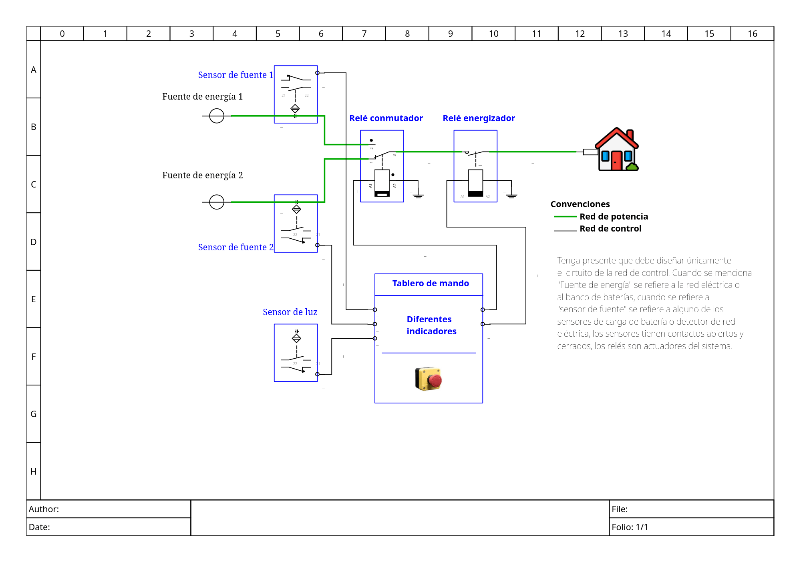
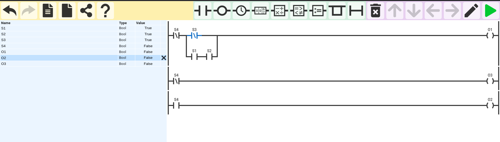
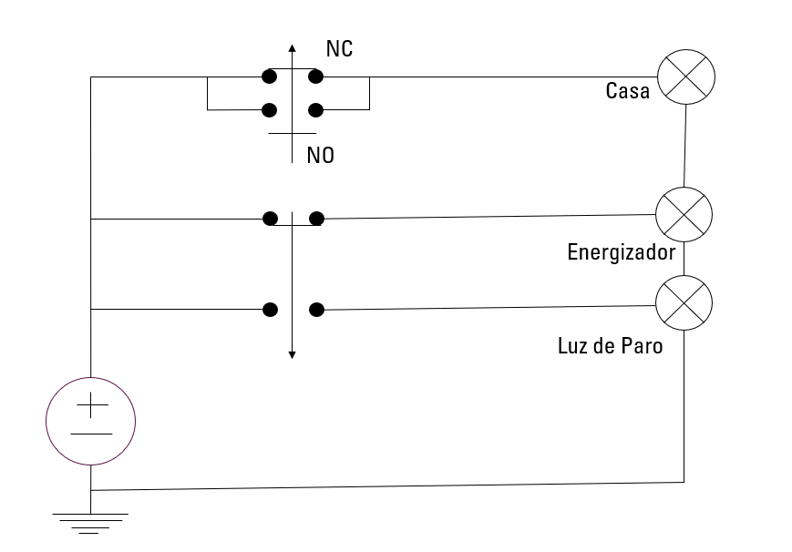
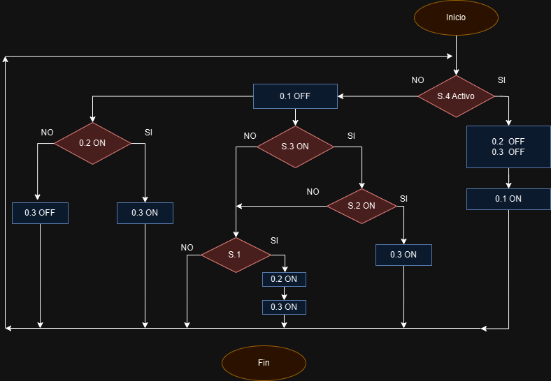
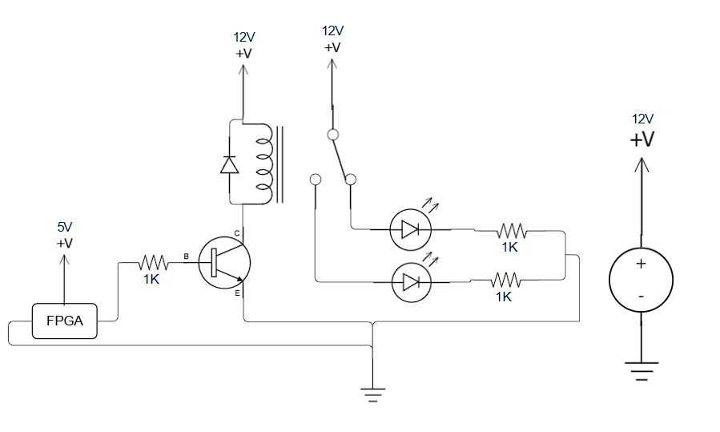

# Lab-2-Digital_1

## Planteamiento del problema
Para este reto de diseño se encargó diseñar un sistema de control para una hipotética casa, la cual puede ser alimentada por la red eléctrica convencional o por baterías, alimentadas por energía solar. Así mismo, cuenta con sensor de luz solar, un paro de emergencia y su respectivo led indicador de paro; el siguiente esquema ejemplifica los requerimientos generales del proyecto.

## Representación circuito eléctrico y lenguaje ladder
Como se puede observar a continuación, el diagrama en lenguaje ladder busca representar el circuito eléctrico del diseño, así como la representación en de modelo circuital:

## Diagrama de Bloques
En este se planteo la lógica de una manera mas comprensible y fuera de las tablas de verdad, que va a seguir el sistema.

## Esquematico del rele
Se busco representar de una manera mas realista, lo que se planteo con el circuito, por lo que se implementó un relé de 12V, para que este hiciera e cambio, conmutando entre la red eléctrica y las baterías, haciendo uso de un bjt para que controlara el paso de la corriente y a el pin NC el ed que indica que se esta usando la red electrica y cuando se apaga ese y se enciende el otro, que esta en NA, nos presenta el cambio a las baterias    

## Presentación del video
https://youtu.be/F3Uq-S-8Q6s
